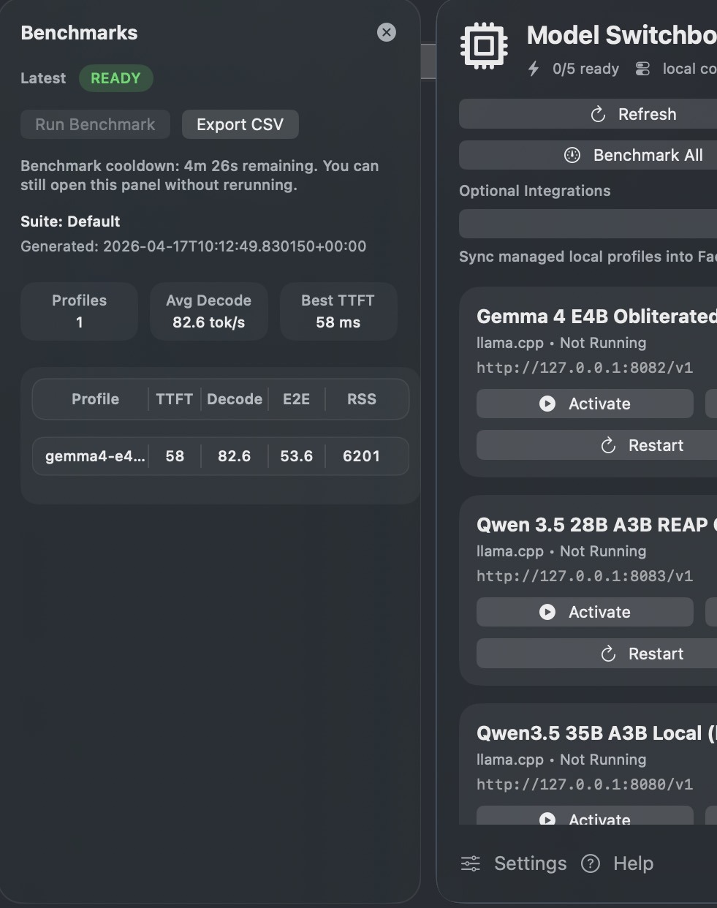

<div align="center">

<picture>
  <source media="(prefers-color-scheme: dark)" srcset="Resources/Brand/title-dark.svg">
  
</picture>

<p>
  <em><strong>Flip between local LLM runtimes from your menu bar.</strong></em><br/>
  <strong>One click to activate. One click to stop everything.</strong>
</p>

<p>
  <a href="https://github.com/AdityaVG13/Model-Switchboard/releases/latest"></a>
  <a href="https://github.com/AdityaVG13/Model-Switchboard/stargazers"></a>
  <a href="SETUP.md"></a>
</p>

<p>
  <a href="VERSION"></a>
  <a href="LICENSE"></a>
  <a href="#requirements"></a>
  <a href="Package.swift"></a>
  <a href="https://github.com/AdityaVG13/Model-Switchboard/actions/workflows/release.yml"></a>
  <a href="CHANGELOG.md"></a>
</p>

<br/>

<table>
<tr>
<td align="center" width="58%" valign="middle">
  
</td>
<td align="center" width="42%" valign="middle">
  
</td>
</tr>
</table>

</div>

---

Running local models on an Apple Silicon Mac usually means a sprawl of terminal windows, half-remembered launch scripts, and no clean way to see **what's actually running.** Model Switchboard puts `llama.cpp`, MLX, Ollama, vLLM, SGLang, TGI, MLC-LLM, Mistral.rs, oMLX, vLLM-MLX, rVLLM MLX, LM Studio, Jan, and named command launchers behind **one menu bar panel.** Click **Activate**, every other model stops, and the one you picked comes up at an OpenAI-compatible endpoint.

*No terminals. No orphan processes. No "green dot" lies.*

---

<table>
<tr>
<td align="center" width="33%" valign="top">
<h3>One-click activate</h3>
<p>Pick a profile. Click <strong>Activate</strong>. Every other model stops. The chosen runtime comes up at an OpenAI-compatible endpoint, and the menu bar reflects the state in real time.</p>
</td>
<td align="center" width="33%" valign="top">
<h3>Health checks, not vibes</h3>
<p>Profiles go green <strong>only</strong> after a real <code>/v1/models</code> probe (or your custom HTTP check) passes. If a managed runtime crashes overnight, the controller restarts it automatically.</p>
</td>
<td align="center" width="33%" valign="top">
<h3>35+ runtimes, one contract</h3>
<p>Native adapters for <code>llama.cpp</code>, MLX, vLLM-MLX, rVLLM MLX, Ollama, vLLM, SGLang, TGI. Named launchers and external endpoints round out the rest. See <a href="Controller/RUNTIME_SUPPORT.md">RUNTIME_SUPPORT</a>.</p>
</td>
</tr>
</table>

---

## What's in the panel

**`Activate` stops every other profile and brings the chosen one up.** No more forgetting to `kill -9` a 24 GB process before starting the next one. Profiles are marked **ready** *only* after a real `/v1/models` probe (or your custom HTTP check) passes — *if it says green, it means green.* Built with **SwiftUI** and `MenuBarExtra`: no Electron, no bundled inference engine, no resident background worker pegging your CPU.

<table>
<tr>
<td align="center" width="33%" valign="top">
  
  <p><strong>Base</strong><br/>Profile fleet with <code>Activate</code> / <code>Start</code> / <code>Stop</code> / <code>Restart</code>.</p>
</td>
<td align="center" width="33%" valign="top">
  
  <p><strong>Plus</strong><br/>Adds live CPU / RAM / GPU, <code>Benchmark All</code>, <code>Reopen Last</code>, <code>Sync Droid</code>.</p>
</td>
<td align="center" width="33%" valign="top">
  
  <p><strong>Benchmarks panel</strong><br/>TTFT, Decode, E2E, RSS per profile. <code>Export CSV</code> and every run lands as JSON + Markdown under <code>Controller/benchmark-results/</code>.</p>
</td>
</tr>
</table>

---

## Runtimes supported

Model Switchboard is runtime-oriented, not model-family-oriented: if your runtime can expose an OpenAI-compatible endpoint, the app can track it, health-check it, switch it, and tag it. That means Qwen, Gemma, Llama, Mistral, GLM, DeepSeek, and other local models are supported through whichever backend serves them.

| Support level | Runtimes and providers |
|---|---|
| **Native command adapters** | `llama.cpp`, MLX / `mlx_lm.server`, `rVLLM MLX`, `vLLM-MLX`, `Ollama`, `vLLM`, `SGLang`, Hugging Face `TGI`, `llama-cpp-python` |
| **Named launcher profiles** | `DDTree MLX`, `TurboQuant`, `oMLX`, `Mistral.rs`, `MLC-LLM`, `LightLLM`, `FastChat`, `OpenLLM`, `Nexa`, `ExLlamaV2`, `Aphrodite`, `LMDeploy`, `MLX Omni Server`, `MLX OpenAI Server`, `MLX Serve`, `text-generation-webui`, `KoboldCpp`, `TabbyAPI`, `llamafile` |
| **External endpoints** | `LM Studio`, `Jan`, `LocalAI`, `LiteLLM`, `ollmlx`, Triton-backed OpenAI-compatible servers, or any local/custom OpenAI-compatible base URL |

Use `RUNTIME_TAGS` for model-level traits such as `coding`, `q8`, `long-context`, `vision`, or `agentic`. The full canonical runtime table lives in [Controller/RUNTIME_SUPPORT.md](Controller/RUNTIME_SUPPORT.md).

---

## Base or Plus

*Same codebase, two apps.* Pick at install time. They live side by side as **Model Switchboard.app** and **Model Switchboard Plus.app** under `~/Applications/`.

The controller contract, profile discovery, runtime tags, and launcher support are shared by both editions. Plus adds the extra operator UI: live utilization badges, benchmarks, reopen-last, and integrations.

<div align="center">

| | Base | Plus |
|---|:---:|:---:|
| Profile list with live status | ✓ | ✓ |
| `Activate` / `Start` / `Stop` / `Restart` | ✓ | ✓ |
| `Refresh` / `Stop All` | ✓ | ✓ |
| `Launch At Login` + attached Settings / Help | ✓ | ✓ |
| CPU / RAM / GPU utilization badges | — | ✓ |
| `Benchmark All` + per-profile `Benchmark` | — | ✓ |
| In-app Benchmarks panel + CSV export | — | ✓ |
| `Reopen Last` | — | ✓ |
| `Sync Droid` and future integration adapters | — | ✓ |

</div>

---

## Requirements

- **macOS 14** (Sonoma) or later
- **Apple Silicon recommended.** Intel Macs run the app fine, but *MLX runtimes require Apple Silicon*
- A running **controller** that exposes the [controller contract](SETUP.md#controller-api-contract). This repo ships a reference controller under `Controller/`

---

## Download

**Signed DMG (recommended).** Grab the latest from **[Releases](https://github.com/AdityaVG13/Model-Switchboard/releases/latest)**:

- `Model-Switchboard-<version>.dmg` (Base)
- `Model-Switchboard-Plus-<version>.dmg` (Plus)

Open, drag to `Applications`, launch.

**From source.**

```bash
git clone https://github.com/AdityaVG13/Model-Switchboard.git
cd Model-Switchboard
./Scripts/install.sh                   # Base
APP_VARIANT=plus ./Scripts/install.sh  # Plus
```

The installer places a fresh build under `~/Applications/`, registers it with Launch Services, and forces a Spotlight import so Raycast and Alfred pick it up immediately.

---

## Quickstart

*Model Switchboard is the control surface. It does not run models itself.* You need a controller that knows how to launch and health-check models.

**1. Install the reference controller:**

```bash
./Controller/install-model-switchboard-controller.sh
```

The controller exposes its API at `http://127.0.0.1:8877` under a per-user LaunchAgent.

**2. Drop a profile manifest** into the controller's `model-profiles/` folder *(the exact path is shown in `Settings`).* If you run the reference controller in this repo, that is `Controller/model-profiles/`; if you keep a dedicated controller root, it is `<controller-root>/model-profiles/`. A minimal `llama.cpp` example:

```env
DISPLAY_NAME=Qwen 3.5 35B Local
RUNTIME=llama.cpp
MODEL_PATH=/path/to/model.gguf
PORT=8080
REQUEST_MODEL=qwen35-local
SERVER_MODEL_ID=qwen35-local
```

**3. Open the menu bar icon.** Your profile appears. Click **`Activate`**.

Every profile must resolve to a unique endpoint. Reusing the same `HOST:PORT` or `BASE_URL` across two profiles is a configuration error, and the controller doctor will flag it.

> Using your own runtime or launcher? Any OpenAI-compatible endpoint works. The controller has adapters and tags for MLX, Ollama, vLLM, SGLang, TGI, llama-cpp-python, rVLLM MLX, vLLM-MLX, DDTree MLX, TurboQuant, Mistral.rs, MLC-LLM, LightLLM, FastChat, OpenLLM, Nexa, ExLlamaV2, Aphrodite, LMDeploy, LiteLLM, external endpoints, and generic binaries. See [runtime support](Controller/RUNTIME_SUPPORT.md).

<details>
<summary><strong>I already downloaded the app — set up the controller for me</strong></summary>

<br/>

Paste this prompt into your favorite AI agent to wire the controller up against the runtimes you actually have installed:

```text
I already downloaded Model Switchboard on my Mac.
Set up the reference controller for me, create working model profiles for the runtimes I actually have installed, and make the configuration portable instead of hardcoding your own assumptions.
Rules:
- This is macOS-only, and that is intentional.
- Do not hardcode Homebrew paths, repo-local build paths, or personal directories unless you first verify they exist on this machine.
- Prefer profile-driven config:
  - `MODEL_PATH` or `MODEL_FILE` with `MODEL_ROOT` for llama.cpp
  - `MODEL_DIR` or `MODEL_REPO` for MLX
  - `SERVER_BIN` when a runtime binary is not already on PATH
  - A named `RUNTIME` plus `START_COMMAND` or `SERVER_BIN` for launchers without a native adapter yet
- Use the controller contract and profile format documented in this repo's `SETUP.md`.
- Put profiles in the controller's `model-profiles` directory.
- Verify that each profile can be started, health-checked, and stopped cleanly.
- If something is missing, inspect the machine and ask me only the minimum necessary question.
End state:
- Model Switchboard opens with valid profiles visible
- `Activate` works
- health checks go green only when the endpoint is actually ready
- nothing is tied to one specific Mac beyond what is truly installed here
```

</details>

---

## Troubleshooting

If something looks off, these labels tell you what the app is seeing right now:

| Label | Where it appears | Meaning |
|---|---|---|
| `RUNNING` | Profile card badge | Process is currently running. |
| `NOT RUNNING` | Profile card badge | Process is not running. |
| `STARTING` / `STOPPING` / `RESTARTING` / `ACTIVATING` | Profile card badge | Action is in progress for that profile. |
| `STALE` | Footer chip near the clock | Last successful status refresh is older than ~45 seconds. |
| `CACHED` | Footer chip near the clock | Controller was temporarily unavailable and the app is showing last cached status. |
| `ERROR` | Footer chip near the clock | Latest refresh or action returned an error. |
| `RUNNING` / `READY` | Plus Benchmarks panel | Benchmark job is active / no benchmark currently running. |

---

## What's new

See **[CHANGELOG.md](CHANGELOG.md)** for release-by-release detail and **[Releases](https://github.com/AdityaVG13/Model-Switchboard/releases)** for signed DMG downloads. Current version: **1.1.5**.

---

## Integrations

- **Raycast** — extension scripts under [`Integrations/Raycast/`](Integrations/Raycast/) call the same controller API the menu bar uses.
- **SwiftBar** — drop-in plugin at [`Controller/swiftbar/local-models.15s.sh`](Controller/swiftbar/local-models.15s.sh) renders the same status, start, stop, and restart actions in any SwiftBar-friendly menu.
- **Factory Droid** — `Sync Droid` (Plus only) pushes managed profiles into Droid's custom-model settings. First of several planned sync adapters.

---

## Deep docs

All the deeper material lives in one place so this README stays skimmable:

> **[SETUP.md](SETUP.md)** — profile formats, supported runtimes, health checks, controller API contract, build-from-source flow, release pipeline, Raycast power-user notes, troubleshooting, and known limitations.
> **[Controller/RUNTIME_SUPPORT.md](Controller/RUNTIME_SUPPORT.md)** — canonical runtime table, launch modes, profile templates, readiness modes.
> **[CHANGELOG.md](CHANGELOG.md)** — release-by-release changes and distribution hardening notes.

*The app's **Help** button opens the same doc.*

---

## Contributing

PRs, issues, and profile recipes are welcome. A few ground rules that keep the project reusable:

- **Keep the app generic.** Runtime-specific behavior belongs in the controller or a profile manifest.
- **The controller HTTP contract is the stability boundary.** Make additive changes only.
- External tools stay **optional integrations**, never required features.
- Ship a runnable example with any new adapter.

**`Sync Droid` is currently Factory-Droid-specific** because that's the agent I run. The integration slot is generic, but the adapter is not. **PRs that add sync adapters for other local-model terminals or agentic tools are very welcome**, including but not limited to **Cursor**, **Windsurf**, **OpenAI Codex CLI**, **Zed**, **Continue**, **Aider**, **LM Studio**, **Ollama chat frontends**, or any **OpenAI-compatible consumer**.

If you build one, follow the shape of `Controller/sync-droid-local-models.py` and register it under `Controller/integrations/` so it shows up in the Plus menu automatically. Full contributor guide and the release pipeline live in [SETUP.md](SETUP.md).

Before opening a PR:

```bash
swift test && ./Scripts/check-cycles.py && ./Scripts/build-app.sh
```

For maintainers, release prep is scriptable instead of hand-editing version files:

```bash
python3 Scripts/bump-version.py patch   # or minor / major / x.y.z
./Scripts/release-preflight.sh
```

---

## License

**[MIT](LICENSE)** © 2026 AdityaVG13

<div align="center">

<br/>

*Model Switchboard is a solo side project, open-sourced for free.*

If it saves you time flipping between local models, a small tip helps cover the API and tooling bills that keep it moving forward.

<a href="https://ko-fi.com/AdityaVG13">
  
</a>

</div>
