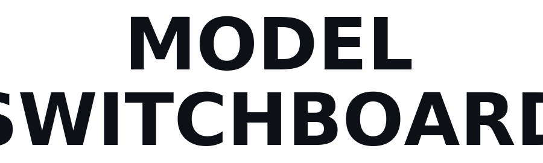
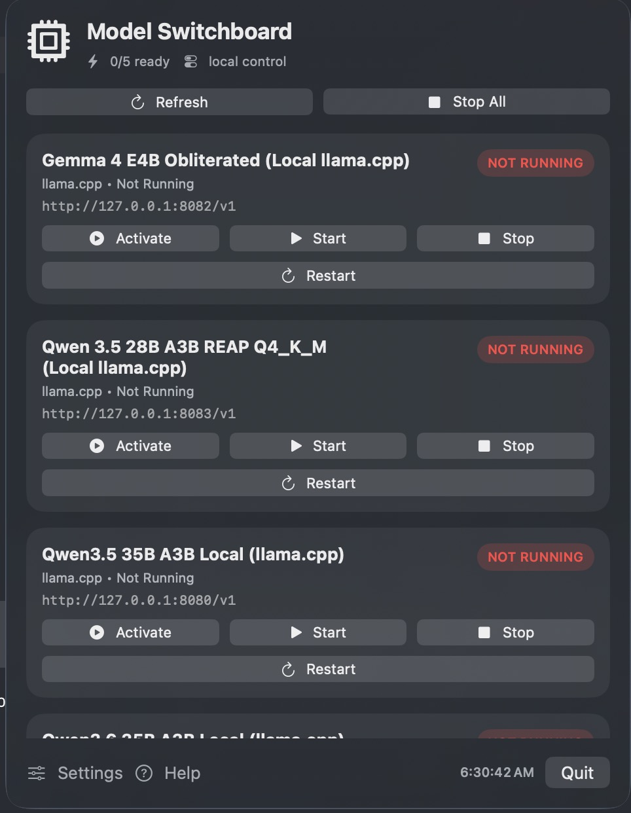
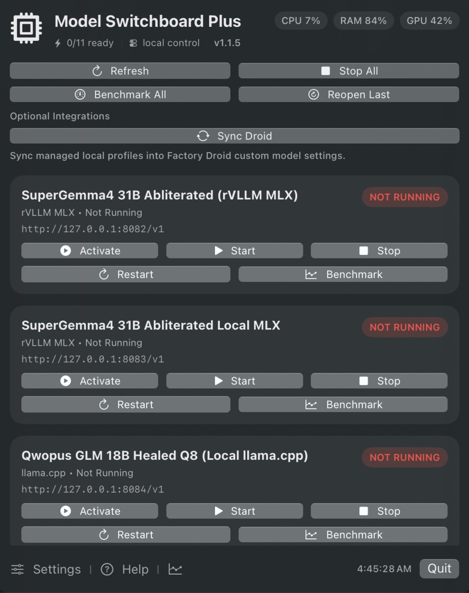
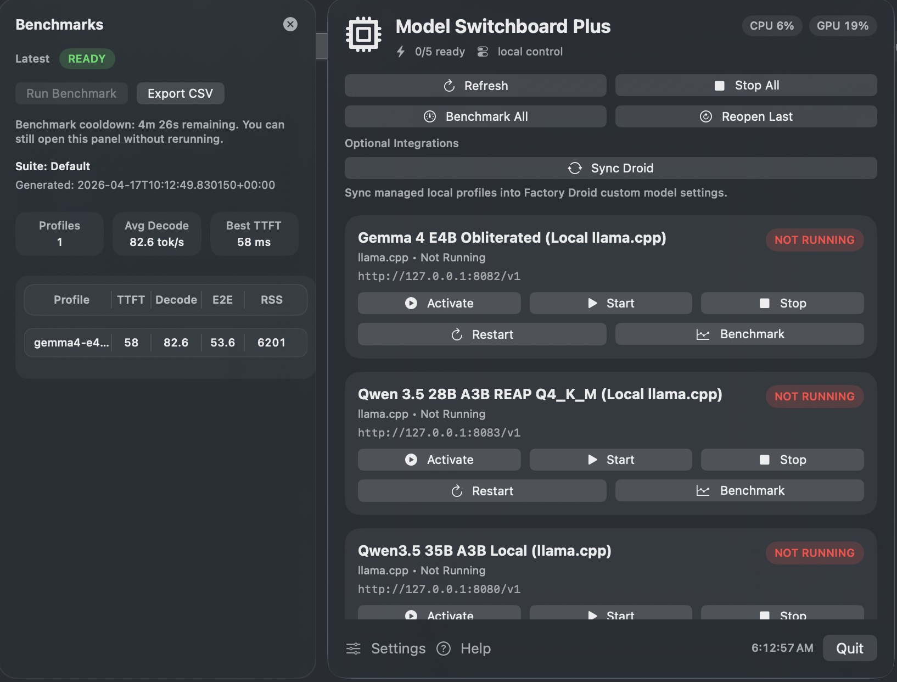

<div align="center">

<picture>
  <source media="(prefers-color-scheme: dark)" srcset="Resources/Brand/title-dark.svg">
  
</picture>

***Flip between local LLM runtimes from your menu bar.***
**One click to activate. One click to stop everything.**

[](VERSION)
[](LICENSE)
[](#requirements)
[](Package.swift)

</div>

---

Running local models on an Apple Silicon Mac usually means a sprawl of terminal windows, half-remembered launch scripts, and no clean way to see **what's actually running.** Model Switchboard puts `llama.cpp`, MLX, Ollama, vLLM, SGLang, TGI, MLC-LLM, Mistral.rs, oMLX, vLLM-MLX, rVLLM MLX, LM Studio, Jan, and named command launchers behind **one menu bar panel.** Click **Activate**, every other model stops, and the one you picked comes up at an OpenAI-compatible endpoint.

*No terminals. No orphan processes. No "green dot" lies.*

---



### One click. One model running.

**`Activate` stops every other profile and brings the chosen one up.** No more forgetting to `kill -9` a 24 GB process before starting the next one.

Profiles are marked **ready** *only* after a real health check passes. By default, the app checks `/v1/models`, and you can swap in a custom HTTP probe. If it says green, it means green.

Built with **SwiftUI** and `MenuBarExtra`. No Electron, no bundled inference engine, no resident background worker pegging your CPU.

<br clear="right">

---



### Plus adds the numbers.

**CPU, RAM, and GPU utilization** live in the header, so you know what your machine is doing *without* dropping into Activity Monitor.

**`Benchmark All`** runs the fleet. **`Reopen Last`** jumps straight back to what you had up. **`Sync Droid`** pushes your managed profiles into Factory Droid's custom-model settings, so the model you just activated is the one Droid uses. It is the first of several planned sync adapters ([see contributing](#contributing)).

<br clear="left">

---



### Benchmarks in the app, not a spreadsheet.

The inline panel reads the latest run and shows **TTFT**, **Decode**, **E2E**, and **RSS** per profile in one place.

Tap **`Export CSV`** and you have a portable report. Every run lands as both JSON and Markdown under `Controller/benchmark-results/`, so it is easy to diff, commit, or feed into another tool.

<br clear="right">

---

## Base vs Plus

*Same codebase, two apps.* Pick at install time. They live side by side as **Model Switchboard.app** and **Model Switchboard Plus.app** under `~/Applications/`.

The controller contract, profile discovery, runtime tags, and launcher support are shared by both editions. Plus adds the extra operator UI: live utilization badges, benchmarks, reopen-last, and integrations.

| | Base | Plus |
|---|:---:|:---:|
| Profile list with live status | ✓ | ✓ |
| `Activate` / `Start` / `Stop` / `Restart` | ✓ | ✓ |
| `Refresh` / `Stop All` | ✓ | ✓ |
| `Launch At Login` + attached Settings / Help | ✓ | ✓ |
| CPU / RAM / GPU utilization badges | - | ✓ |
| `Benchmark All` + per-profile `Benchmark` | - | ✓ |
| In-app Benchmarks panel + CSV export | - | ✓ |
| `Reopen Last` | - | ✓ |
| `Sync Droid` and future integration adapters | - | ✓ |

---

## Requirements

- **macOS 14** (Sonoma) or later
- **Apple Silicon recommended**. Intel Macs run the app fine, but *MLX models require Apple Silicon*
- A running **controller** that exposes the [controller contract](SETUP.md#controller-api-contract). This repo ships a reference controller under `Controller/`

---

## Install

**Signed DMG (recommended).** Grab the latest from **[Releases](https://github.com/AdityaVG13/Model-Switchboard/releases/latest)**:

- `Model-Switchboard-<version>.dmg` (Base)
- `Model-Switchboard-Plus-<version>.dmg` (Plus)

Open, drag to `Applications`, launch.

Maintainers can cut the next release with:

```bash
python3 Scripts/bump-version.py patch
```

Push that version-bump commit to `main` and GitHub Actions will build, notarize, and publish the release automatically.

**From source.**

```bash
git clone https://github.com/AdityaVG13/Model-Switchboard.git
cd Model-Switchboard
./Scripts/install.sh                   # Base
APP_VARIANT=plus ./Scripts/install.sh  # Plus
```

The installer places a fresh build under `~/Applications/`, registers it with Launch Services, and forces a Spotlight import so Raycast and Alfred pick it up immediately.

---

## Let your AI set it up

If you already downloaded the app and just want the controller and profiles wired up, give your favorite AI this prompt:

```text
I already downloaded Model Switchboard on my Mac.

Set up the reference controller for me, create working model profiles for the runtimes I actually have installed, and make the configuration portable instead of hardcoding your own assumptions.

Rules:
- This is macOS-only, and that is intentional.
- Do not hardcode Homebrew paths, repo-local build paths, or personal directories unless you first verify they exist on this machine.
- Prefer profile-driven config:
  - `MODEL_PATH` or `MODEL_FILE` with `MODEL_ROOT` for llama.cpp
  - `MODEL_DIR` or `MODEL_REPO` for MLX
  - `SERVER_BIN` when a runtime binary is not already on PATH
  - A named `RUNTIME` plus `START_COMMAND` or `SERVER_BIN` for launchers without a native adapter yet
- Use the controller contract and profile format documented in this repo's `SETUP.md`.
- Put profiles in the controller's `model-profiles` directory.
- Verify that each profile can be started, health-checked, and stopped cleanly.
- If something is missing, inspect the machine and ask me only the minimum necessary question.

End state:
- Model Switchboard opens with valid profiles visible
- `Activate` works
- health checks go green only when the endpoint is actually ready
- nothing is tied to one specific Mac beyond what is truly installed here
```

---

## First run

*Model Switchboard is the control surface. It does not run models itself.* You need a controller that knows how to launch and health-check models.

**1. Install the reference controller:**

```bash
./Controller/install-model-switchboard-controller.sh
```

**2. Drop a profile manifest** into the controller's `model-profiles/` folder *(the exact path is shown in `Settings`).* If you run the reference controller in this repo, that is `Controller/model-profiles/`; if you keep a dedicated controller root, it is `<controller-root>/model-profiles/`. A minimal `llama.cpp` example:

```env
DISPLAY_NAME=Qwen 3.5 35B Local
RUNTIME=llama.cpp
MODEL_PATH=/path/to/model.gguf
PORT=8080
REQUEST_MODEL=qwen35-local
SERVER_MODEL_ID=qwen35-local
```

**3. Open the menu bar icon.** Your profile appears. Click **`Activate`**.

Every profile must resolve to a unique endpoint. Reusing the same `HOST:PORT` or `BASE_URL` across two profiles is a configuration error, and the controller doctor will flag it.

> Using your own runtime or launcher? Any OpenAI-compatible endpoint works. The controller has adapters and tags for MLX, Ollama, vLLM, SGLang, TGI, llama-cpp-python, rVLLM MLX, vLLM-MLX, DDTree MLX, TurboQuant, Mistral.rs, MLC-LLM, LightLLM, FastChat, OpenLLM, Nexa, ExLlamaV2, Aphrodite, LMDeploy, LiteLLM, external endpoints, and generic binaries. See [runtime support](Controller/RUNTIME_SUPPORT.md).

## Status labels

If something looks off, these labels tell you what the app is seeing right now:

| Label | Where it appears | Meaning |
|---|---|---|
| `RUNNING` | Profile card badge | Process is currently running. |
| `NOT RUNNING` | Profile card badge | Process is not running. |
| `STARTING` / `STOPPING` / `RESTARTING` / `ACTIVATING` | Profile card badge | Action is in progress for that profile. |
| `STALE` | Footer chip near the clock | Last successful status refresh is older than ~45 seconds. |
| `CACHED` | Footer chip near the clock | Controller was temporarily unavailable and the app is showing last cached status. |
| `ERROR` | Footer chip near the clock | Latest refresh or action returned an error. |
| `RUNNING` / `READY` | Plus Benchmarks panel | Benchmark job is active / no benchmark currently running. |

---

## Documentation

All the deeper material lives in one place so this README stays skimmable:

> **[SETUP.md](SETUP.md)**: profile formats, supported runtimes, health checks, controller API contract, build-from-source flow, release pipeline, Raycast power-user notes, troubleshooting, and known limitations.

> **[CHANGELOG.md](CHANGELOG.md)**: release-by-release changes and distribution hardening notes.

*The app's **Help** button opens the same doc.*

---

## Contributing

PRs, issues, and profile recipes are welcome. A few ground rules that keep the project reusable:

- **Keep the app generic.** Runtime-specific behavior belongs in the controller or a profile manifest.
- **The controller HTTP contract is the stability boundary.** Make additive changes only.
- External tools stay **optional integrations**, never required features.
- Ship a runnable example with any new adapter.

### Especially wanted: more sync adapters

**`Sync Droid` is currently Factory-Droid-specific** because that's the agent I run. The integration slot is generic, but the adapter is not. **PRs that add sync adapters for other local-model terminals or agentic tools are very welcome**, including but not limited to:

- **Cursor** / **Windsurf**: push the active profile into the OpenAI-compatible provider settings
- **OpenAI Codex CLI**: update `~/.codex/config.toml` model entry
- **Zed**: update `~/.config/zed/settings.json` assistant provider
- **Continue** (`~/.continue/config.json`)
- **Aider**: point at the active endpoint
- **LM Studio** / **Ollama chat frontends** / any **OpenAI-compatible consumer**

If you build one, follow the shape of `Controller/sync-droid-local-models.py` and register it under `Controller/integrations/` so it shows up in the Plus menu automatically.

Before opening a PR:

```bash
swift test && ./Scripts/check-cycles.py && ./Scripts/build-app.sh
```

For maintainers, release prep is scriptable instead of hand-editing version files:

```bash
python3 Scripts/bump-version.py patch   # or minor / major / x.y.z
./Scripts/release-preflight.sh
```

---

## License

**[MIT](LICENSE)** © 2026 AdityaVG13

---

<div align="center">

### Support the project

*Model Switchboard is a solo side project, open-sourced for free.*
If it saves you time flipping between local models, a small tip helps cover the API and tooling bills that keep it moving forward.

<a href="https://ko-fi.com/AdityaVG13">
  
</a>

</div>
